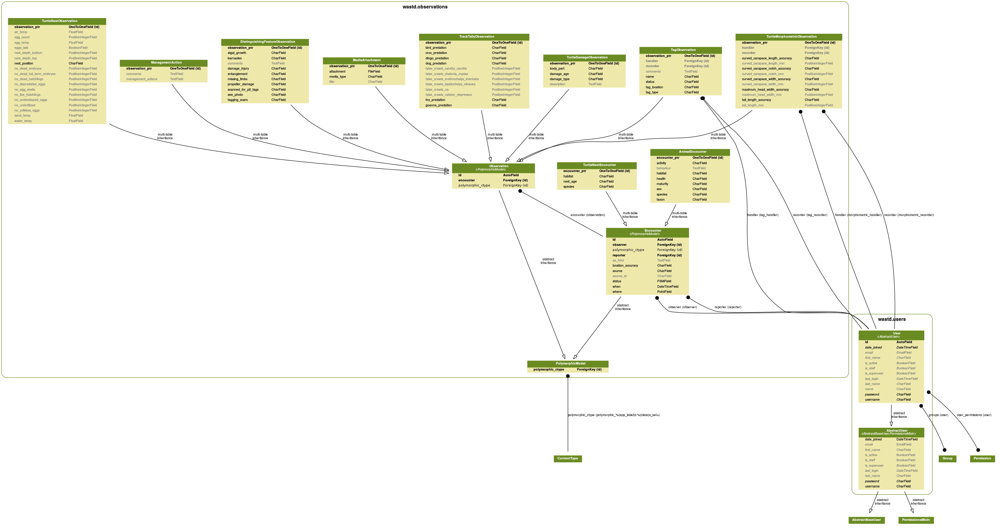

.. _dev-docs:

***********************
Developer documentation
***********************

This chapter is targetted at developers and those who would like to understand
the underlying data model.

In this chapter, we will discuss:

* the data model - what data can WAStD handle?
* the admin - manual data entry, validation, widgets
* the API - programmatic data retrieval and query
* the custom User app
* remaining modules of the observations app
* design smells

.. _design-smells:

Design smells
=============
Let's start this chapter with early design decisions that could be refactored to be improved.

Unique identifiers
------------------
Fields with unique identifiers are called ``name``. The word ``name`` is overloaded.
The mixin class ``shared.models.CodeLabelDescriptionMixin`` brings three fields:

* code  - a unique, short, URL-safe short code
* label - a human-readable label
* description - a longer, comprehensive, complete description

Smell: inconsistent use of "name", "label", for unique identifiers across the codebase and docstrings.

Legacy sources
--------------
Two competing ways of tracking an upstream point of truth:
``shared.models.LegacySourceMixin`` and per model ChoiceField lookups.
The underlying value is either a SmallInt (quick lookups, but incomrehensive to the user), or a short string.

Smell: refactor to use ``shared.models.LegacySourceMixin``. Mind that R package wastdr and ETL pipelines need to be updated too.

Hard-coded lookups
------------------
Hard-coding lookups prevents data corruption by over-eager admin users.
Since we have much higher code churn than data model churn, these lookups are easy enough to maintain.

Smell: where to define lookup dicts - currently mixed in ``observations.models`` at both top level and model level.

.. _extend-app:

Extending the application
=========================

ObservationGroup
----------------

TFA, TFL, TEC paper forms contain further observation groups, which
are reviewed and evaluated for trustworthiness separately.

Each group becomes a model in TSC, inheriting from ``occurrences.models.ObservationGroup``.
WAStD can add new instances of ``Observation``.

* Model: add model to ``occurrences.models`` inheriting from ObservationGroup.
* Migration: create, run in dev.
* Form: create form for use in admin and views.
* Admin: add Inline and standalone admin.
* Views: CreateView, UpdateView. DetailView is that of related encounter.
* URLs: create and update URLs. Add ``update_url`` to model.
* Templates: card template for obsgroup model, add "create" link to either CAE/TAE detail template where applicable.
* Tests: Create sample instances, view on detail page. Call create and update urls.
* Docs: Migrate legacy docs on how to fill in the obsgroup sections.
* DevOps: git, docker, deploy, migrate.

.. _data-model:

Data model
==========
WAStD is designed to handle biological
observations of any kind which happen during an encounter.

Both Encounters and Observations are polymorphic (database table inheritance)
and share one primary key, while allowing for different fields for child models.

E.g., AnimalEncounters are Encounters (where, when, observed by, recorded by)
with an Animal (species, sex, maturity, health). The combination of Animal
attributes can determine which subsequent Observations are required.

Following this "mix&match" approach, e.g. an AnimalEncounter with a dead turtle
will be a "Turtle Stranding" encounter, requiring TurtleMorphometricObesrvations,
DistinguishingFeatureObservations, TurtleDamageObservations etc.

An AnimalEncounter with a nesting (= female, mature) turle will be a "Turtle
Tagging" encounter, which requires a TurtleNestObservation, plus the above
types of observations.

Both encounters will share MediaAttachments (photos, scanned field data sheet)
and (if appropriate) TagObservations (flipper / PIT / satellite tags, biopsy
samples etc.).

`observations.models` Module
---------------------------------------

Admin
=====
We're using a nicely styled admin to let trained data entry operators and
curators add and update data.

Also, data analysts can search, filter, and export data from here.

`observations.admin` Module
---------------------------------------

API
===
The API is intended for programmatic access to data, mainly to batch-import
and batch-export.

The rest
========
This concludes the documentation of the key features.
The following sections document the remaining modules for completeness' sake.

`users` app
----------------------
WAStD's custom user package, courtesy of pydanny's django project template.

`observations` app
-----------------------------
Remaining modules of the observations package are documented here.

===================================
Project delivery: ticking the boxes
===================================

This chapter closes the development circle by pairing functional requirements with
corresponding functional, unit and view tests.
The tests are documented inline with the requirements they cover; the documentation
is extracted in the build process and shown below.

This chapter should read to business owners as a walk-through of their business processes.
Ideally, all requirements from the detailed requirements analysis find their counterpart in the following section.

Tests are structured into:

* Unit tests: the basics
    * data structure (model X must have field Y),
    * model functions (string representation of model X must include field Y)

* View tests: the boring bits
    * Do all pages load?
    * Do named URLs work?
    * Are all required page HTML templates in place?
    * Do all view functions work?

* Functional tests: the meat and potatoes
    * Business logic: following real-world scenarios
    * Permissions: which role can see / do what when?
    * Conditions: what needs to be done and present before a step can be executed?
    * Consequences: what will happen if I hit this button?

WA Strandings and WA Sea Turtles
================================

Observations
------------
`observations.tests` Module

Users
-----
`users.tests` Module
